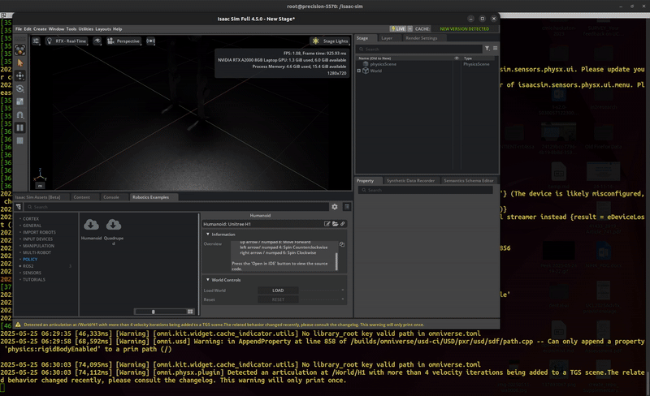

# :robot:  nvidia-open-source-robot-lab
A repository with examples for running **NVIDIA Isaac Sim**, **Isaac Lab**, and **ROS** using containers. 🧪🧠🐳

| Humanoid Policy Demo | Franka Lift Cube (RL Training) |
|----------------------|--------------------------------|
|  |  |
| **Isaac Sim Full App**  <br>Windows → Examples → Robotics Example → Policy → Humanoid **[LOAD]** | **Training Command**  <br>`./isaaclab.sh -p scripts/reinforcement_learning/rsl_rl/train.py --task=Isaac-Lift-Cube-Franka-v0` |


## 🛠️ Requirements
- 🐧 Ubuntu > [:link:](https://github.com/mxochicale/tools/tree/main/ubuntu)
- 🐋 Docker > [:link:](https://github.com/mxochicale/code/tree/main/docker)
- 🎮 NVIDIA Drivers and Container Toolkit > [:link:](https://github.com/mxochicale/code/tree/main/gpu/installation)

## 🏗️ Build and run with bash scripts

🐳 **Build and Run Docker image**
```bash
bash isaac-docker.sh --version 5.1.0 --ros-distro Humble build
bash isaac-docker.sh --version 5.1.0 --ros-distro Humble run
docker system prune -f --volumes
```
* sample output for docker images
```bash
REPOSITORY       TAG            IMAGE ID       CREATED             SIZE
isaac_sim_ros2   5.0.0-Humble   a74b6685718f   About an hour ago   19.1GB
```

## 🐳 Running Pre-Built Isaac Lab Container 
Instructions to run pre-built isaac lab with container registry [ref](https://isaac-sim.github.io/IsaacLab/main/source/deployment/docker.html). See official tag releases of [isaac-lab](https://catalog.ngc.nvidia.com/orgs/nvidia/containers/isaac-lab/tags?version=2.3.1)

```bash
bash isaac-docker.sh --lab-version 2.3.2 pull-lab
```
* sample output for docker images
```bash
REPOSITORY                 TAG       IMAGE ID       CREATED       SIZE
nvcr.io/nvidia/isaac-lab   2.3.2     <id>           8 weeks ago   17.6GB
```

* Run isaac lab with some examples
```bash
bash isaac-docker.sh --lab-version 2.3.2 launch-lab
```

* Run examples within the container
```bash
#reinforcement_learning
./isaaclab.sh -p scripts/reinforcement_learning/rsl_rl/train.py --help
./isaaclab.sh -p scripts/reinforcement_learning/rsl_rl/train.py --task=Isaac-Velocity-Flat-H1-v0 --num_envs 5 --max_iterations 10 #--headless
./isaaclab.sh -p scripts/reinforcement_learning/rsl_rl/train.py --task=Isaac-Ant-v0 --headless
./isaaclab.sh -p scripts/reinforcement_learning/rsl_rl/train.py --task=Isaac-Humanoid-v0
./isaaclab.sh -p scripts/reinforcement_learning/rsl_rl/train.py --task=Isaac-Lift-Cube-Franka-v0
./isaaclab.sh -p scripts/reinforcement_learning/rsl_rl/train.py --task=Isaac-Velocity-Flat-H1-v0
./isaaclab.sh -p scripts/reinforcement_learning/rsl_rl/train.py --task=Isaac-Velocity-Rough-H1-v0
./isaaclab.sh -p scripts/reinforcement_learning/rsl_rl/train.py --task=Isaac-Velocity-Flat-G1-v0
./isaaclab.sh -p scripts/reinforcement_learning/rsl_rl/train.py --task=Isaac-Velocity-Rough-G1-v0
#TRAIN and PLAY with Isaac-Ant-v0
./isaaclab.sh -p scripts/reinforcement_learning/rsl_rl/train.py --task Isaac-Ant-v0 --num_envs 10 --max_iterations 100
./isaaclab.sh -p scripts/reinforcement_learning/rsl_rl/play.py --task Isaac-Ant-v0 --num_envs 10 --checkpoint logs/rsl_rl/ant/2026-02-10_00-33-56/model_99.pt 
#TRAIN and PLAY with Isaac-Cartpole-Direct-v0
./isaaclab.sh -p scripts/reinforcement_learning/rsl_rl/train.py --task Isaac-Cartpole-Direct-v0 --num_envs 10 --max_iterations 100
./isaaclab.sh -p scripts/reinforcement_learning/rsl_rl/play.py --task Isaac-Cartpole-Direct-v0 --num_envs 128 --checkpoint logs/rsl_rl/cartpole_direct/
#TRAIN and PLAY with Isaac-Humanoid-v0
./isaaclab.sh -p scripts/reinforcement_learning/rsl_rl/train.py --task Isaac-Humanoid-v0 --num_envs 128 --max_iterations 100
./isaaclab.sh -p scripts/reinforcement_learning/rsl_rl/train.py --task Isaac-Humanoid-v0 --num_envs 128 --max_iterations 2000 --headless
./isaaclab.sh -p scripts/reinforcement_learning/rsl_rl/play.py --task Isaac-Humanoid-v0 --num_envs 1000 --checkpoint logs/rsl_rl/humanoid
#
#Demos
./isaaclab.sh -p scripts/demos/arms.py
./isaaclab.sh -p scripts/demos/h1_locomotion.py
./isaaclab.sh -p scripts/demos/bipeds.py
#The list of environments available registered with OpenAI Gym can be found by running:
./isaaclab.sh -p scripts/environments/list_envs.py
```

## Links
* [References](docs/README.md#references)
* See other Environment IDs > https://isaac-sim.github.io/IsaacLab/main/source/overview/environments.html

## 📥 Clone repository
```bash
git clone git@github.com:mxochicale/nvidia-open-source-robot-lab.git
```
